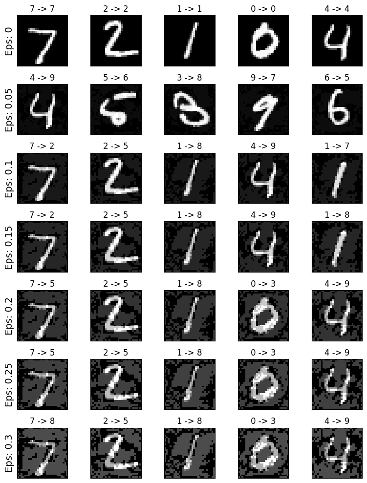

# Adversarial Examples on MNIST

This repository explores how a neural network for MNIST digit classification can be fooled by adversarial examples generated with FGSM.

## What are adversarial examples?

Adversarial examples are inputs that are intentionally modified with small perturbations to cause a model to make wrong predictions, even when the image still looks the same to humans.

## What is FGSM?

FGSM (Fast Gradient Sign Method) is a one-step adversarial attack.  
It adds a perturbation in the direction that maximally increases the model loss:

$$
x_{adv} = x + \epsilon \cdot \text{sign}(\nabla_x J(\theta, x, y))
$$

where:

- $x$ is the original image
- $\epsilon$ controls perturbation strength
- $J$ is the loss function

## Results
### Model accuracy

| Epsilon | Accuracy |
|---|---:|
| 0.00 | 97.88% |
| 0.05 | 76.96% |
| 0.10 | 30.76% |
| 0.15 | 11.01% |
| 0.20 | 4.60% |
| 0.25 | 1.95% |
| 0.30 | 1.04% |

Note: Clean accuracy of the model at $\epsilon = 0$

### Adversarial examples at different $\epsilon$ values

## Conclusion

The model performs very well on clean MNIST data, but accuracy drops sharply under FGSM attacks as epsilon increases. This demonstrates that high standard accuracy does not imply adversarial robustness. Also there is a tradeoff between the effectiveness of an adversarial attack and how easily the pertubations are percievable by a human.
